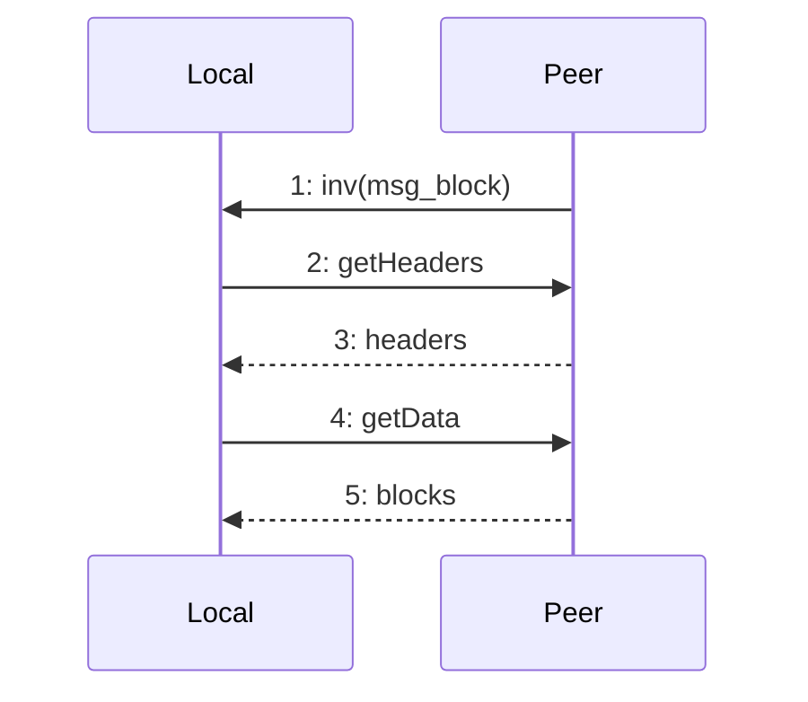
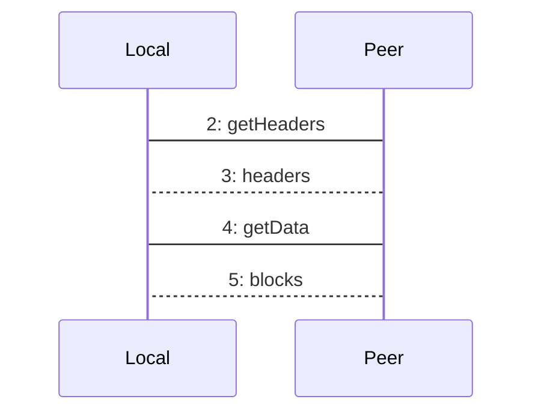

## 1.3 同步

### 1.3.1 同步场景

#### 1.3.1.1 建立连接

1. 一个节点收到连接请求时，它立即宣告其版本，发送 `version` 消息。在通信双方都得到对方版本之前，不会有其他通信
2. 版本不低于209的客户端在应答version消息时发送 `verack` 消息

!!! note
    相同的 版本 意味着相同的程序

#### 1.3.1.2 INV(MSG_BLOCK) 的发送

1. 挖到新的 block
2. 从其他节点获取到新的 block，即 接收到 `cmpctblock`，`blocktxn`, `block` 这三个消息，并确认之后
3. 应答 getblocks 消息 

!!! note
    应答 getblocks 消息时，只发送 inv 消息，让请求端自己进行对比筛选，有确定需要的 block 时，请求端会发送 getdata 来获取实际的 block 的全部信息

#### 1.3.1.3 getheaders 的发送

1. 新节点 (主动请求)
2. 接到 inv 消息后，意识到自己的 headers 不够新 (被动)

!!! note
    1. 接到 getheaders 请求的节点，会以 headers 消息应答，最多 2000 个 header
    2. 请求端如果得到的应答 (headers 消息) 包含 2000 个 header，意味着 应答端可能拥有更多的 header，需要再次获取 (循环获取)
    3. 如果节点在初始化中，会忽略 getheaders 消息，因为没有能力处理

### 1.3.2 被动获取新 Block

#### 1.3.2.1 过程描述

1. Peer 节点挖出了新 block，或者接受了新 block (可能是多个)，发出 inv(MSG_BLOCK) 消息
2. Local 节点接收到 inv(MSG_BLOCK) 消息，取出了里面的 header hash 列表，在本地进行对比，找出本地没有的 header hash 列表，发出 getheaders 消息，通过 hash_start, hash_stop 表明范围，最多 2000 条，如果要尽可能多的获取，hash_stop 设为 0
3. Peer 节点接到 getheaders 的消息，按要求查出来本地的 header 列表 (不只是 hash，是完整的 block header 信息)，最多 2000 条，发送给 Local 节点
4. Local 节点接到 headers 消息后，进行验证，如果 headers 不连续，则认为 Peer 节点恶意捣乱，会做标记。然后进行 POW 验证，包括 hash 难度是不是在增加。通过验证的 header hash 信息会写入 levelDB，其余信息在内存中保留 (此处还需确认)，如果 Peer 端返回的 headers 达到了最高值 2000 条，则继续获取 (循环获取)
5. Local 节点根据已确认的 header 列表，发出 getdata 消息，包含一个向量清单
6. Peer 节点收到 getdata 消息后，会按要求从磁盘读取 block 列表，发送 block 消息给 Local 节点，这里似乎 block 消息每次只发送一个 block
7. Local 节点收到 block 消息后，进行 merkle_tree 等一系列验证，通过验证的 block 讲写入磁盘

### 1.3.3 主动获取新 Block

### 1.3.3.1 过程描述