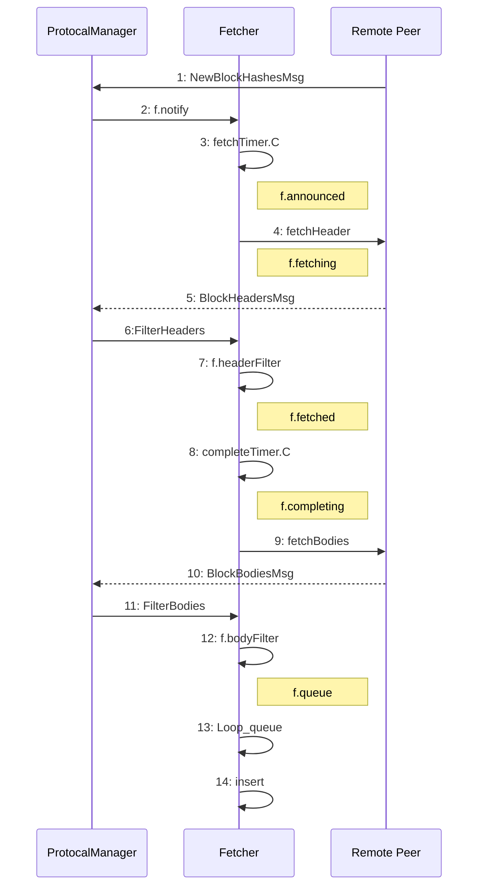
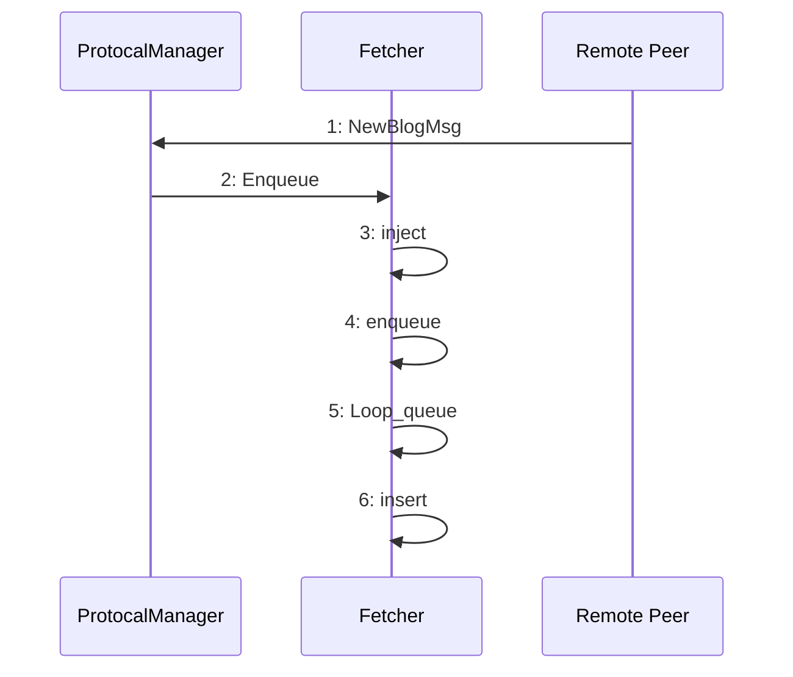

# 数据同步

## 1 被动同步

被动同步由fetcher完成，被动模式又分为两种
1. 收到blockhash广播消息(NewBlockHashesMsg)
2. 收到完整的block广播消息(NewBlockMsg)

### 1.1 NewBlockHashesMsg 被动模式

#### 1.1.1 过程描述

1. 收到外部节点NewBlockHashesMsg消息，确定本地没有，然后发送一个announce给fetcher
2. fetcher 循环处理收到的消息，header 消息放到 f.fetching (正在获取中) 里，按要求发出 fetchHeader
3. 远端收到 fetchHeader 消息会发出 BlockHeadersMsg
4. 收到 header 消息后，检查是否需要获取 body
5. 如果需要，发出 fetchBodies 消息
6. 远端回复 BlockBodiesMsg
7. 得到 body 数据，验证，存储

### 1.2 NewBlockMsg 被动模式

#### 1.2.1 过程描述

NewBlockHashesMsg 模式的简化

## 2 主动同步

### 2.1 主动同步的主要场景

1. geth刚启动
2. 新peer加入
3. 定时sync

### 2.2 查找通信节点主链共同祖先

1. 比特币是将本地chain顶端N个block的hash及后续以1/2跳跃的方式得到m个block的hash(blocklocator)发送给外部节点，这样外部节点能轻松的找到两个节点的链的共同祖先

2. 以太币不一样，它分两个步骤来操作，第一步是向外部节点请求N个block的hash并和本地对比找到共同祖先，如果第一步没有找到祖先，则按照类似1/2跳跃的方式循环请求更前面的区块的hash，并和本地对比来找到共同祖先

3. 可见两种方式的核心区别是，比特币是主动提供本地链区块头信息，外部节点负责找出祖先，而以太币是从外部节点获取数据，本地负责找出祖先。如果共同祖先大部分都是在前N个区块，这两种方式差不多，但是如果进行到1/2跳跃请求，则以太坊的请求次数明显增多。