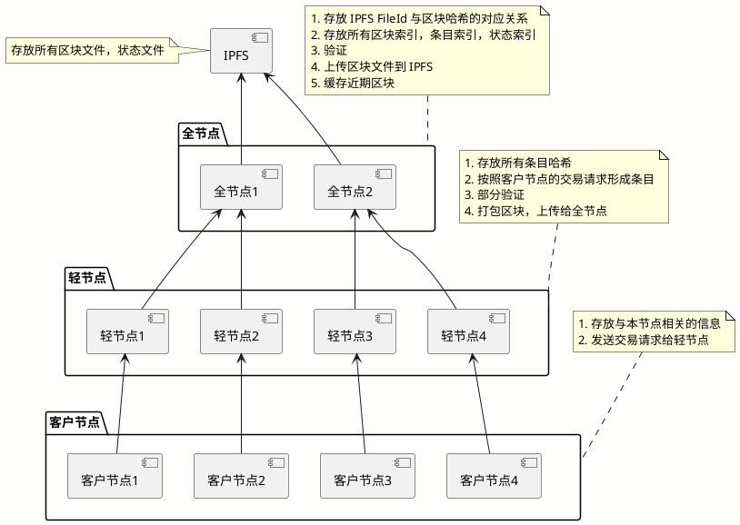

# Trias 数据存储

## 1. 存储结构

### 1.1 文件系统

文件系统用来存储区块数据，状态数据，历史数据，以二进制数据文件或文本文件来存储。

#### 1.1 文件存储的优势

1. 不受平台影响(操作系统)
2. 不需要更多依赖(相对于数据库来说)
3. 便于与 IPFS 这种去中心化文件系统进行对接
4. 适当的对文件大小进行规划，对文件进行组织，便于传播

#### 1.2 基础数据结构

##### 1.2.1 Block

| 大小(字节) |    名称     | 数据类型 |             描述              |
| ---------- | ----------- | -------- | ----------------------------- |
| 4          | magicNumber | uint32   | 值 待定, 作为区块之间的分隔符 |
| 4          | blockSize   | uint32   | 后面数据到块结束的字节数      |
| 68         | blockHeader | []byte   | 块头 (大小待定)               |
| varint     | itemCount   | uint64   | 条目数量                      |
| varies     | items       | []byte   | 条目集合                      |

##### 1.2.2 Header

| 大小(字节) |        名称         | 数据类型 |               描述                |
| ---------- | ------------------- | -------- | --------------------------------- |
| 4          | version             | uint32   | 版本号                            |
| 32         | previous_block_hash | [32]byte | 前一个 block 的 hash 值           |
| 32         | merkle_root_hash    | [32]byte | 区块内所有 Item 的 merkle_hash 值 |

!!! todo "Header 中的其他项待定"
    比如比特币中的 Hash 难度值，计算用的随机数 Nonce 跟共识算法相关，这里待定

##### 1.2.3 条目

| 大小(字节) |    名称     | 数据类型 |   描述   |
| ---------- | ----------- | -------- | -------- |
| 4          | itemType    | uint32   | 类型     |
| varint     | payloadSize | uint32   | 载荷大小 |
| varies     | payload     | []byte   | 载荷     |

!!! note "条目 (Item)"
    条目 是一个宽泛的概念，它可以是类似比特币的交易，也可以是类似以太坊的交易，这样可以带来两个好处：

    1. 使得账号状态，UTXO 两种不同机制的数据可以共存
    2. 对已有结构进行改进，可以重新定义一个 itemType 及其解释方式

### 1.2 索引系统

用来快速定位存储内容。通过索引可以快速定位到 Block，Item (各种交易或其他数据形式)，以及 Item 当中子项。索引系统使用 levelDB。

## 2 节点分工

### 2.1 全节点

1. 与 IPFS 文件系统进行对接，存储 IPFS 返回的 FileId，形成 FileId 与区块 Hash 的映射关心 
2. 存放所有区块索引，条目索引，状态索引
3. 能提供全面的验证
4. 上传区块文件到 IPFS
5. 缓存近期区块

!!! note
    IPFS 只负责存储文件，并不参与业务逻辑，如何解析文件内容，还需要全节点来负责。
    IPFS 的 FileId 虽然也是内容哈希，但与区块哈希的计算规则并不相同，所以需要保存映射关系

### 2.2 轻节点

1. 存放所有条目哈希，在接到客户节点交易请求时可根据条目哈希从全节点获取条目数据，进行验证
2. 按照客户节点的交易请求形成条目
3. 部分验证
4. 打包区块，上传给全节点

### 2.3 客户节点

1. 保存与本节点相关的信息，最大化减少数据存储量，增强客户节点的可用性

## 3 同步

### 3.1 被动同步

#### 3.1.1 被动同步时机

#### 3.1.1.1 NewBlockHashMsg

全节点

过程描述:

1. Peer FullNode 在存入新区块，或获取新区块之后 发出 NewBlockHashMsg
2. Local FullNode 获取到 NewBlockHashMsg，在本地进行对比，若不存在，则发出 GetBlockMsg 给 Peer FullNode
3. Peer FullNode 获取到 GetBlockMsg 后，从本地查询并通过 BlockMsg 将 Block 信息发送给 Local FullNode
4. Local FullNode 在拿到 Block 信息之后，计算 Block，Item 等信息的索引，并将 Block，相关索引保存

轻节点

过程描述:

1. Peer FullNode 在存入区块，或获取新区块之后 发出 NewBlockHashMsg
2. Local LightNode 获取到 NewBlockHashMsg，在本地进行对比，若不存在，则发出 GetBlockHashMsg 给 Peer FullNode
3. Peer FullNode 通过 BlockHashMsg 将 BlockHash, ItemHash 等信息发送给 Local ClientNode
4. Local ClientNode 保存 BlockHash, ItemHash 等信息

!!! note "BlockHashMsg"
    BlockHashMsg 会包含区块当中的 条目 Hash

## 3.2 主动同步

### 3.2.1 主动同步时机

#### 3.2.1.1 新节点加入

全节点

过程描述:

1. 当一个新的全节点加入，会循环向其他 FullNode 发出 GetHeaderHashMsg
2. 远端 FullNode 发送 HeaderHashMsg 给本节点
3. 本节点根据 HeaderHash 向远端节点 发出 GetBlockMsg 
4. 远端 FullNode 发送 BlockMsg 给本节点
5. 本节点进行数据保存

轻节点

过程描述:

1. 当一个新的全节点加入，会循环向其他 FullNode 发出 GetHeaderHashMsg
2. 远端 FullNode 发送 HeaderHashMsg 给本节点
5. 本节点进行数据保存